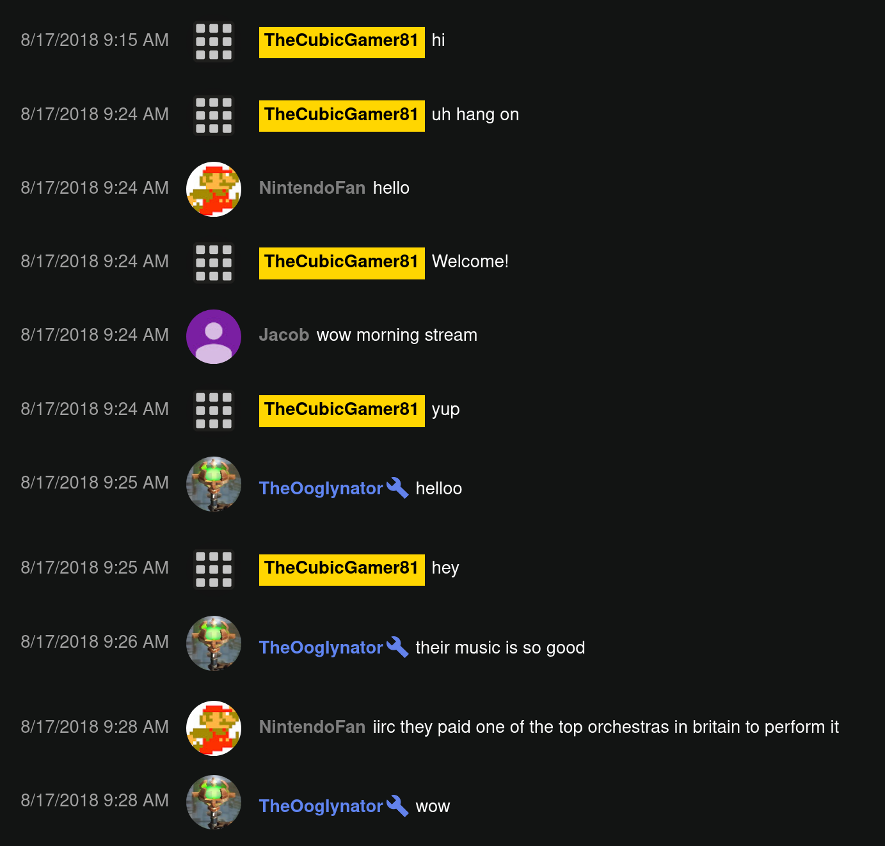

# YoutubeChatExporter
A quick program to export YouTube live-chats in various different formats



## Setting up
1. Clone the repository
2. Create a python virtual environment
3. Install dependencies through pip `pip install -r requirements.txt`

## Usage
```
A quick program to export YouTube live-chats in various different formats

positional arguments:
  Youtube identifier   Youtube IDs or URLs of streams to extract chat from

optional arguments:
  -h, --help           show this help message and exit
  -o, --output         directory to export live chat(s) to
  -f, --format         format to archive chat as. Acceptable values are: DarkHtml (default), LightHtml, PlainText
  -s, --split          Split output into partitions with the given amount of messages
  --no-download-image  use urls in html output instead of downloading to disk
  --update             Reconstruct output without redownloading assets.```
```

## Future Plans
#### In order of importance
* Improve speed
* Additional backends
* Verbose mode
* Add more formats
